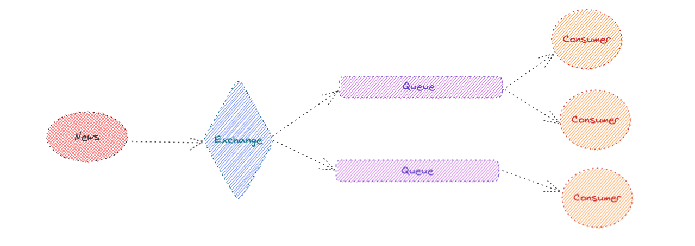

# 工作原理

下面是一张工作原理的简图；



## 五大基础组件

- `Exchange` 交换机，每个交换机就是一个分发数据到队列的路由；

- `Queue` 队列，队列是一个能存储数据和配合 operators 处理数据的组件，丰富的配置和管道操作符可以实现更复杂的功能；

- `News` 消息，存储内容的组件；

- `Consumer` 消费者，处理消息的业务逻辑代码；

- `Logs` 日志消息，方便调试开发，也可将日志发送到服务器；

## 1、Exchange

```javascript
const exchange = new Exchange(Option);
```

创建交换机

**Option 参数说明**

| 名称     | 类型     | 必填 | 说明                                     |
| -------- | -------- | ---- | ---------------------------------------- |
| name     | String   | 否   | 交换机名称                               |
| routes   | String[] | 否   | 需要匹配的队列名称                       |
| repeater | Function | 否   | 自定义路由函数，填写该参数 routes 将失效 |

## 2、Queue

```javascript
const queue = new Option(Option);
```

创建队列

**Option 参数说明**

| 名称    | 类型              | 必填 | 默认  | 说明                                                                        |
| ------- | ----------------- | ---- | ----- | --------------------------------------------------------------------------- |
| name    | String            | 否   |       | 队列名称                                                                    |
| mode    | "Random" \| "All" | 否   | "All" | 消费模式，Random 代表随机抽取一个消费者消费，All 代表所有消费者都会消费消息 |
| ask     | Boolean           | 否   | false | 是否需要消息确认，为 true，则需要手动确认消息                               |
| rcn     | Number            | 否   | 3     | 消费失败后可重复消费次数                                                    |
| async   | Boolean           | 否   | false | 是否是异步队列，为 false 则会一条消息消费完成或者失败才会消费下一条消息     |
| maxTime | Number            | 否   | 3000  | 最长消费时长，单位毫秒，小于 0 代表不限时长                                 |

## 3、News

```javascript
const news = new News(Any);
```

创建消息

**news 属性说明**

| 名称          | 类型   | 说明               |
| ------------- | ------ | ------------------ |
| createTime    | Number | 消息创建时间戳     |
| content       | Any    | 消息内容           |
| consumedTimes | number | 剩余可重复消费次数 |

## 4、Consumer

```javascript
const consumer = new Consumer(Consume, PayLoad);
```

创建消费者

**Consume 参数说明**

| 参数   | 类型     | 说明                                                            |
| ------ | -------- | --------------------------------------------------------------- |
| 参数 1 | 消息内容 |                                                                 |
| 参数 2 | next     | 是否确认消费，执行 next 默认为确认消费，传 false 则代表消费失败 |
| 参数 3 | payload  | 固定消费内容，每次消费都会传递                                  |

**consumer 属性说明**

| 名称       | 类型     | 说明             |
| ---------- | -------- | ---------------- |
| createTime | Number   | 消费者创建时间戳 |
| consume    | Function | 消费方法         |
| payload    | any      | 固定载荷         |

## 5、Logs

//TODO:Logs md
