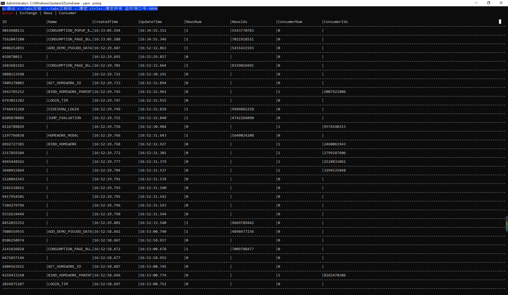

# termui 开发工具使用



    `termui`是使用`go`开发的日志查看工具，皆在方便开发者查看组件之间数据交互情况；目前仅支持window使用；

## 安装使用

在安装`u-node-mq`以后，可在`package.json`中配置以下启动命令

```json
  "scripts": {
    "unmq": "u-node-mq",
  }
```

然后在代码中开启自定义日志输出，并实现 CustomLogFunction 方法，`termui`默认监听端口号为`9090`，下面为示例代码；

```javascript
import { Logs } from "u-node-mq";
Logs.setLogsConfig({
  logs: true, //建议只在开发环境开启
  types: ["custom", "console"],
  customFunction: (name, data) => {
    //发送数据到termui 的 9090端口
    http.post("http://localhost:9090/" + name, {
      data,
      header: {
        "content-type": "application/json;charset=utf-8",
      },
    });
  },
});
```

**Queue 日志说明**

| 名称        | 说明                           |
| ----------- | ------------------------------ |
| ID          | 队列 id                        |
| name        | 队列名称，创建队列名称可能为空 |
| createdTime | 创建时间                       |
| updateTime  | 最近更新时间                   |
| NewsNum     | 队列内消息总数                 |
| NewsIds     | 队列内消息 Id 数组             |
| ConsumerNum | 监听队列的消费者总数           |
| ConsumerIds | 监听队列的消费者 Id 数组       |

**Exchange 日志说明**

| 名称          | 说明                               |
| ------------- | ---------------------------------- |
| ID            | 交换机 id                          |
| name          | 交换机名称，创建交换机名称可能为空 |
| createdTime   | 创建时间                           |
| updateTime    | 最近更新时间                       |
| acceptedCount | 接收到消息的总数                   |
| sendCount     | 发送消息到队列的总次数             |
| queueNames    | 发送消息到队列的队列名称数组       |

**News 日志说明**

| 名称        | 说明         |
| ----------- | ------------ |
| ID          | 交换机 id    |
| createdTime | 创建时间     |
| updateTime  | 最近更新时间 |

**Consumer 日志说明**

| 名称          | 说明             |
| ------------- | ---------------- |
| ID            | 交换机 id        |
| createdTime   | 创建时间         |
| updateTime    | 最近更新时间     |
| AcceptedCount | 消费消息的总数量 |

- q 键退出
- 键盘左右键切换 tabs
- c 建清空当前页数据
- ctrl+c 清空所有数据
